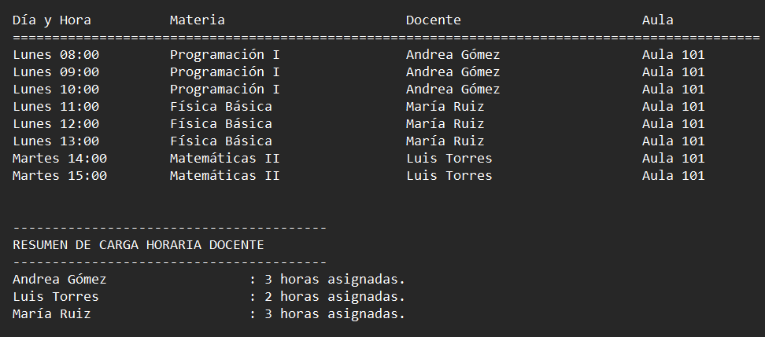

# 🏛️ Horarius

<p align="center">
  
  
  
  
</p>

---

**Horarius** es una solución profesional y automatizada desarrollada en Python para la **gestión y optimización de horarios universitarios**. Diseñado para coordinadores académicos, este motor permite cruzar la disponibilidad de docentes, requerimientos de materias y capacidad de aulas en segundos.

El sistema garantiza una planificación eficiente mediante algoritmos de validación lógica, eliminando errores humanos y garantizando cronogramas libres de conflictos.

---

## 🖼️ Vista Previa (Preview)

<p align="center">
  
</p>

---

## 💎 Características Principales (Key Features)

* **🛡️ Algoritmo Anti-Conflictos:** Validación de disponibilidad en tiempo real que garantiza que ningún aula o docente tenga traslapes de horario.
* **📊 Gestión de Carga Docente:** Motor lógico que calcula automáticamente el total de horas asignadas por profesor, facilitando el control administrativo.
* **📂 Procesamiento de Datos Estructurados:** Sistema de lectura optimizado para archivos planos (`.txt`) organizados en la carpeta `src/`.
* **📄 Generador de Reportes:** Exportación automática de resultados en un formato de tabla alineada profesional, incluyendo un resumen ejecutivo de carga horaria.
* **⚙️ Flexibilidad Horaria:** Soporte para rangos de tiempo flexibles y normalización de formatos (ej. `8:00 - 12:00` o `08:00-12:00`).

---

## 🛠️ Especificaciones Técnicas

* **Lenguaje:** Python 3.13+
* **Arquitectura:** Modular con gestión de rutas dinámicas para recursos externos.
* **Librerías Core:** `os`, `datetime` (Sin dependencias externas pesadas para máxima portabilidad).

---

## 🚀 Implementación Rápida

1. **Clona el repositorio:**
   ```bash
   git clone [https://github.com/JuanCuack/Horarius.git](https://github.com/JuanCuack/Horarius.git)
   cd Horarius
   ```
2.  **Organización de Archivos Requerida:**
    ```text
    Horarius/
    ├── main.py              # Script principal (Lógica de negocio)
    ├── LICENSE              # Archivo de términos legales (MIT)
    ├── .gitignore           # Configuración de exclusión de Git
    ├── README.md            # Documentación del proyecto
    ├── assets/              # Recursos visuales del repositorio
    │    └── Preview.png     # Captura de pantalla de la solución
    └── src/                 # Carpeta de recursos y datos (Obligatoria)
        ├── aula.txt         # Configuración de salones y capacidades
        ├── docentes.txt     # Disponibilidad y carga docente
        ├── materias.txt     # Requerimientos y horas académicas
        └── horario.txt      # Reporte generado automáticamente (Output)
    ```
3.  **Ejecuta la aplicación:**
    ```bash
    python main.py
    ```

---

## 📈 Casos de Uso
1. **Gestión Académica:** Automatización de cronogramas para facultades con alta densidad de materias y docentes.

2. **Optimización de Recursos:** Control eficiente de la ocupación de aulas físicas para evitar tiempos muertos o sobrecupos.

3. **Base Académica:** Proyecto de referencia para el estudio de algoritmos de organización de datos y lógica de programación en Python.

---

## 📄 Licencia (License)

Este proyecto está bajo la **Licencia MIT**. Consulta el archivo `LICENSE` para más detalles.


---

## 👨‍💻 Autor
**JuanCuack** - *Software Engineering Student*

---
